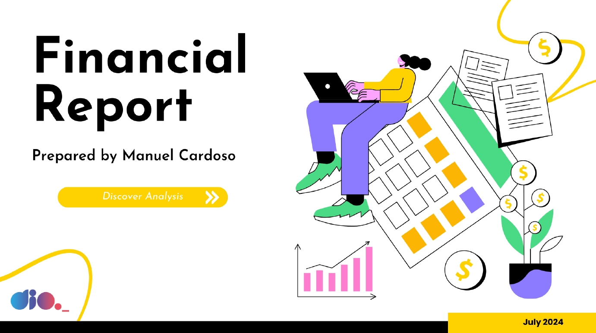
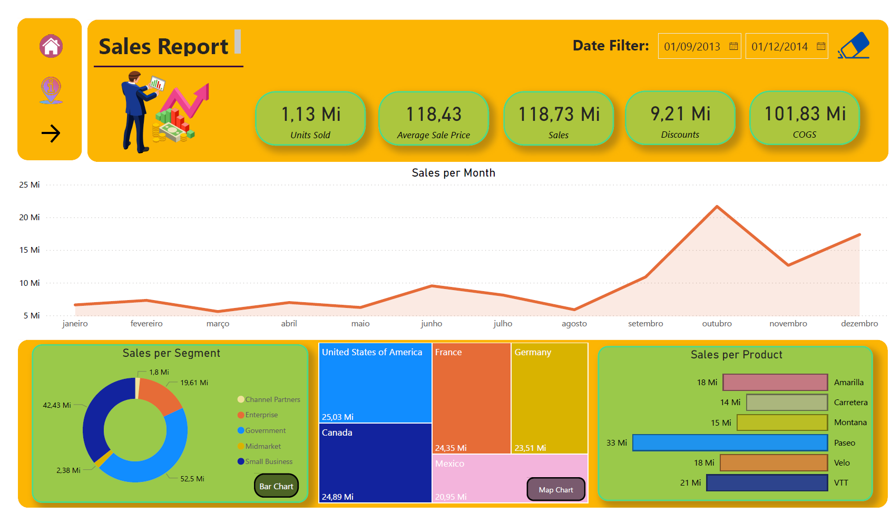
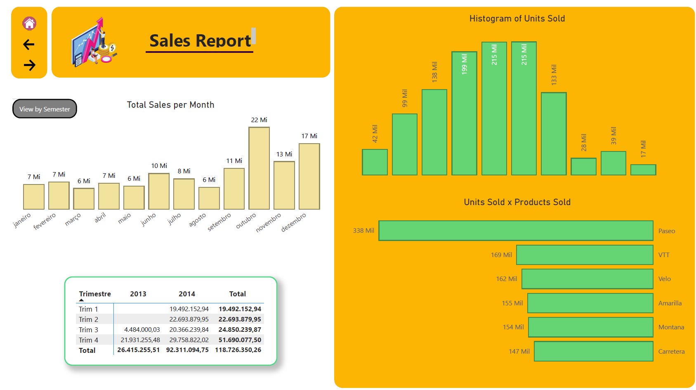
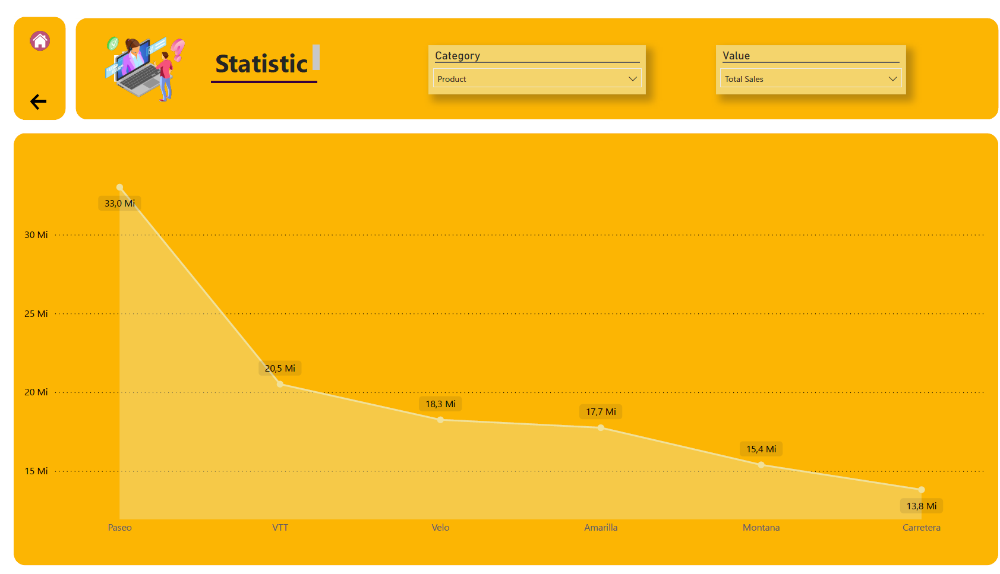

# Visão Geral do Dashboard Financeiro e de Vendas

Este repositório contém um dashboard financeiro e de vendas, oferecendo insights detalhados sobre o desempenho de vendas, segmentação de dados e análise de produtos.

## Páginas do Dashboard

### Página 1: Capa do Relatório

Capa do relatório financeiro preparado por Manuel Cardoso.

### Página 2: Visão Geral do Relatório de Vendas

### Página 3: Métricas Detalhadas de Vendas

### Página 4: Estatísticas Dinâmicas

1. **Primeira Visão:** Parâmetro com base em categorias.
2. **Segunda Visão:** Parâmetros com base em valores (profit, sales, ou outros).
